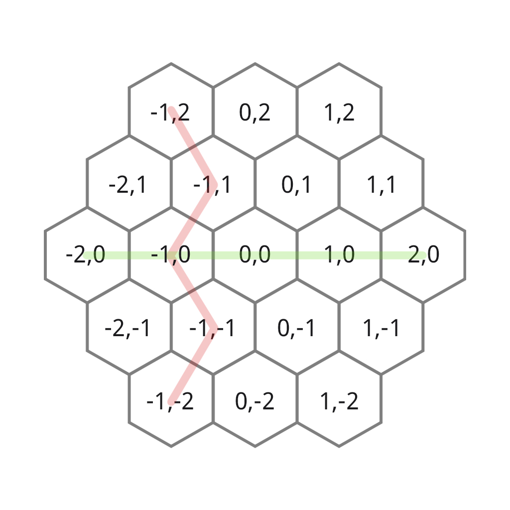

## Chapter 1 - Grid
**[Back to Contents](/README.md)**

The world is built from a grid of Hex tiles.

Each hex has a position in 2D cartesian space. The graphical representation offsets each odd row to the right in order to fit the hexes together.

#### Relative Lookup

Neighbouring hexes are deducible given the position as follows.

 - `W = (x - 1, y)`
 - `E = (x + 1, y)`
 - `NW = isEven ? (x - 1, y + 1) : (x, y + 1)`
 - `NE = isEven ? (x, y + 1) : (x + 1, y + 1)`
 - `SW = isEven ? (x - 1, y - 1) : (x, y - 1)`
 - `SE = isEven ? (x, y - 1) : (x + 1, y - 1)`
 
 Where `isEven = y % 2 == 0`
 
 #### Hex Organization
 
 Hex data is only referenced from the `World` instance in the `State` object.
 
 Hexes are identified by their position, which is used as the key in the main structure. All other structures, index by another property, refer only to the position and **NOT** the hex itself.
 
 Index | Structure 
 --- | ---
 hexByPosition | `MutableMap<Vector2i, Hex>`
 hexPositionsByNationName | `MutableMap<String, MutableSet<Vector2i>>`
 
 #### Data Retrieval
 
 The following methods are callable on the given objects.
 
 ##### State Object
 - `getHexByPosition(position: Vector2i): Hex?`
 - `getHexesByNationName(nationName: String): Set<Hex>`
 - `getHexesByFlood(hexes: Set<Hex>, start: Hex): Set<Hex>`
 - `getHexesByFlood(hexPositions: Set<Vector2i>, start: Vector2i): Set<Hex>`
 
 